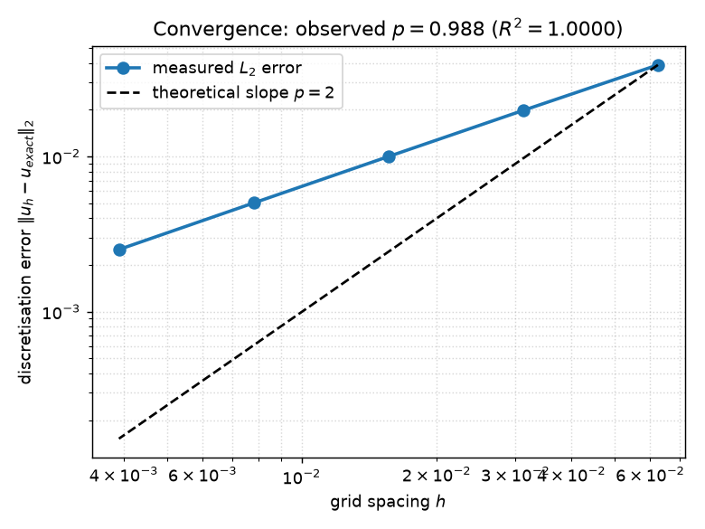
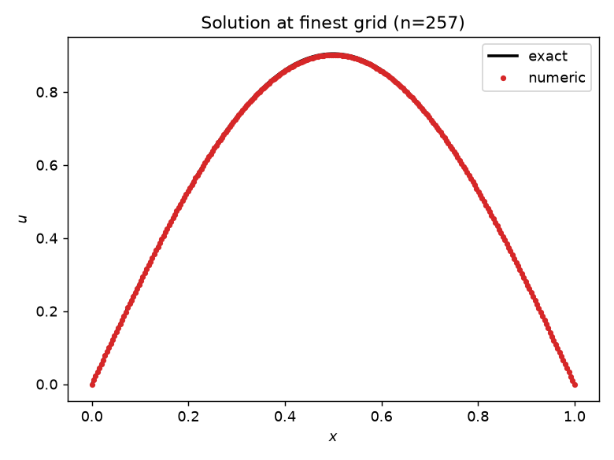
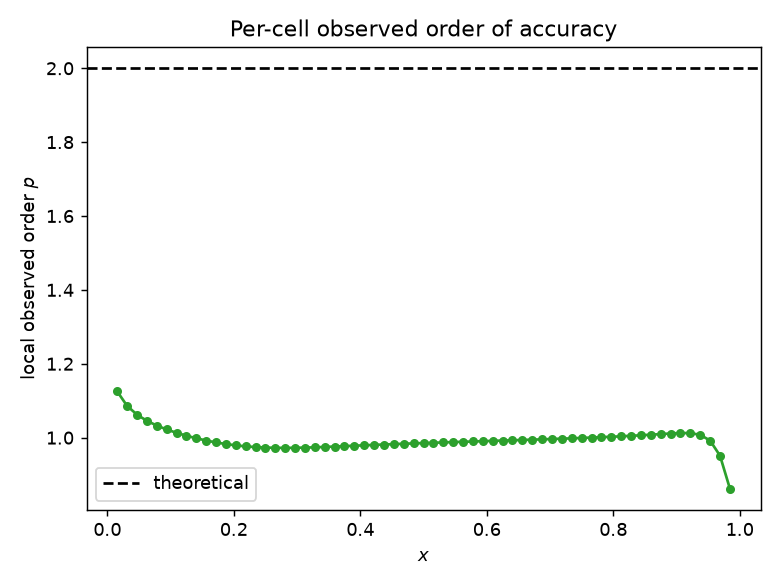

# Bug caught: advection-diffusion with 1st-order upwind

> ## ❌ VERDICT: **FAIL**
>
> Observed order **0.988** vs theoretical **2** (deficit +1.012, tolerance ±0.25).

*Generated by pdeforge on 2026-06-16 — kernel backend: `numba`.*

## Problem

Governing equation: $ u_t + \mathbf{v}\cdot\nabla u = \alpha\,\nabla^2 u + f $
Manufactured solution: $ u = e^{- 0.5 t} \sin{\left(\pi x \right)} $
Derived source: $ f = \left(- 0.5 \sin{\left(\pi x \right)} + 0.01 \pi^{2} \sin{\left(\pi x \right)} + 1.0 \pi \cos{\left(\pi x \right)}\right) e^{- 0.5 t} $

The source term above was **derived automatically** by the Method of Manufactured
Solutions, so the exact solution is known to machine precision and the
discretisation error below is exact.

## Grid-refinement study

| grid $n$ | spacing $h$ | $L_2$ error | $L_\infty$ error | pairwise order |
|---------:|------------:|------------:|------------------:|---------------:|
| 17 | 6.250e-02 | 3.887e-02 | 5.529e-02 | — |
| 33 | 3.125e-02 | 1.979e-02 | 2.809e-02 | 0.974 |
| 65 | 1.562e-02 | 9.984e-03 | 1.417e-02 | 0.987 |
| 129 | 7.812e-03 | 5.014e-03 | 7.117e-03 | 0.994 |
| 257 | 3.906e-03 | 2.513e-03 | 3.566e-03 | 0.997 |

Least-squares fit of $\log E$ vs $\log h$ over all grids gives observed order
**$p = 0.988$** with $R^2 = 1.0000$.

## Discretisation uncertainty (GCI, Celik 2008)

| quantity | value |
|----------|-------|
| apparent order $p$ | 0.988 |
| Richardson-extrapolated value | 0.639844 |
| fine-grid GCI | 0.479 % |
| medium-grid GCI | 0.954 % |
| asymptotic-range ratio | 1.0038 |
| in asymptotic range? | yes |

## Solution and error

## Per-cell observed order

## References

1. P. J. Roache, *Verification and Validation in Computational Science and
   Engineering*, Hermosa, 1998.
2. K. Salari, P. Knupp, *Code Verification by the Method of Manufactured
   Solutions*, SAND2000-1444, 2000.
3. I. Celik et al., *Procedure for Estimation and Reporting of Uncertainty Due to
   Discretization in CFD Applications*, J. Fluids Eng. 130(7), 2008.
4. ASME V&V 20-2009, *Standard for Verification and Validation in Computational
   Fluid Dynamics and Heat Transfer*.
